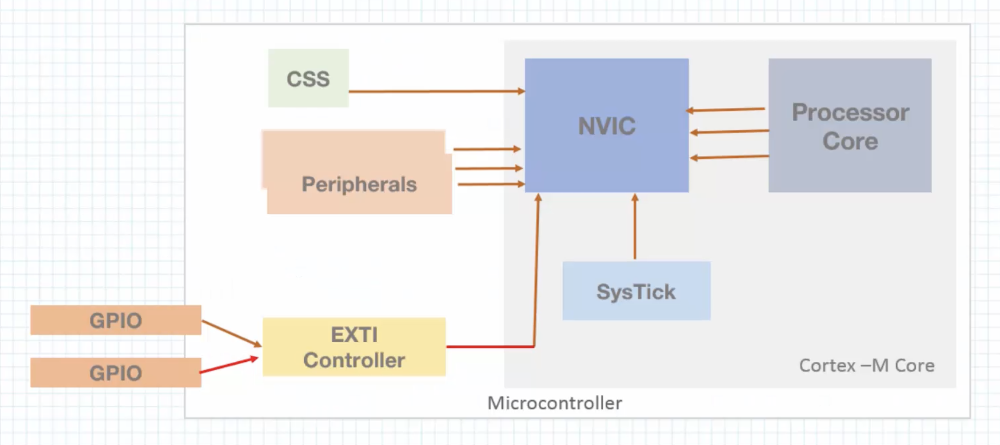
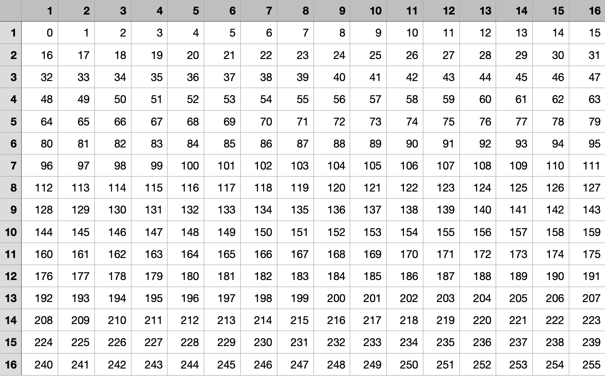

# Udemy class - Embedded Systems Bare-Metal Programming Ground Up (STM32)

## Where is the LED?

User guide for Nucleo board (um1724-stm32-nucleo64-boards-mb1136.pdf)
states 'PA5', or port (A) and pin (5).

To identify the memory location needed to get to PortA, look in the
microcontroller's data sheet (stm32f401re.pdf).

Use the reference manual (rm0368-stm32f401x.pdf) to identify specific
registers & pins e.g., the RCC enable register.

Videos 5, 6, 7, 10 are important to understanding the use of pins.

__GPIO modules have at least 2 registers:__

- Direction register (set pin as input or output)
- Data register (write to or read from pin)

__Two types of buses:__

- Advanced High-Performance Bus (AHB) - 1 clock cycle to access peripherals
- Advanced Peripheral Bus (APB) - minimum of 2 clock cycles to access peripherals

__Clock Sources__

- On-chip RC Oscillator - least precise.
- Externally Connected Crystal - Most precise.
- Phase Locked Loop (PLL) - Programmable.

Offsets are from the data sheet.

Need to type-cast the defines to volatile unsigned integer to avoid
the compiler optimizing them away.

## Turn on an LED

```cpp
#define PERIPH_BASE           (0x40000000UL)

#define AHB1PERIPH_OFFSET     (0x00020000UL)
#define AHB1PERIPH_BASE       (PERIPH_BASE + AHB1PERIPH_OFFSET)

#define GPIOA_OFFSET          (0x0000UL)
#define GPIOA_BASE            (AHB1PERIPH_BASE + GPIOA_OFFSET)

#define RCC_OFFSET            (0x3800UL)
#define RCC_BASE              (AHB1PERIPH_BASE + RCC_OFFSET)

#define AHB1EN_R_OFFSET       (0x30UL)
#define RCC_AHB1EN_R          (*(volatile unsigned int *)(RCC_BASE +  AHB1EN_R_OFFSET))

#define MODE_R_OFFSET         (0x00UL)
#define GPIOA_MODE_R          (*(volatile unsigned int *)(GPIOA_BASE + MODE_R_OFFSET))

#define OD_R_OFFSET           (0x14UL)
#define GPIOA_OD_R            (*(volatile unsigned int *)(GPIOA_BASE +  OD_R_OFFSET))

#define  GPIOAEN              (1U<<0) //  0b 0000 0000 0000 0000 0000 0000 0000 0001

#define PIN5                  (1U<<5)
#define LED_PIN               PIN5


int main(void)
{
  // enable clock access to GPIOA
  RCC_AHB1EN_R  |=  GPIOAEN;

  // set PA5 as an output pin - mode for pin 5 is General Purpose Output (01)
  GPIOA_MODE_R  |= (1U<<10);  // Set bit 10 to 1
  GPIOA_MODE_R  &=~(1U<<11); //  Set bit 11 to 0

    while(1)
    {
      //GPIOA_OD_R |= LED_PIN;  // set PA5 high
      
      GPIOA_OD_R ^= LED_PIN; // toggle PA5 high and low
      for(int i=0; i<1000000; i++){}
    }
}
```

## Toggle an LED

Search on STM32F4 at st.com and download the STM32CubeF4 firmware package on the Tools and Software tab. Alternatively this can be found on GitHub here -> https://github.com/STMicroelectronics/STM32CubeF4.

The repo does not include some of the middleware due to licensing. Either way, this is about 2 Gb so in this project, put only the essential files in the 'Inc' folder. These are probably:

- cmsis_compiler.h
- cmsis_gcc.h
- cmsis_version.h
- core_cm4.h
- mpu_armv7.h
- stm32f4xx.h
- stm32f401xe.h
- system_stm32f4xx.h

In this project, includes can be either option 1 or 2 (used) as below. Option 2 allows for better intellisense in CubeIDE.

### Option 1 - Define the processor and the general header

```cpp
#define STM32F401xE			1
#include <stm32f4xx.h>

#define GPIOAEN 			(1U<<0)
#define PIN5				(1U<<5)
#define LED_PIN				PIN5

int main(void)
{
	RCC->AHB1ENR |= GPIOAEN;  // enable clock access to GPIOA
	// set PA5 as an output pin - mode for pin 5 is General Purpose Output (01)
	GPIOA->MODER |= (1U<<10); // Set bit 10 to 1
	GPIOA->MODER &=~(1U<<11); // Set bit 11 to 0

	while (1)
	{
		GPIOA->ODR ^=LED_PIN;
		for(int i=0; i<1000000; i++){}
	}
}
```

### Option 2 - Include a processor-specific header

```cpp
#include <stm32f401xe.h>

#define GPIOAEN 			(1U<<0)
#define PIN5				(1U<<5)
#define LED_PIN				PIN5

int main(void)
{
	RCC->AHB1ENR |= GPIOAEN;  // enable clock access to GPIOA
	// set PA5 as an output pin - mode for pin 5 is General Purpose Output (01)
	GPIOA->MODER |= (1U<<10); // Set bit 10 to 1
	GPIOA->MODER &=~(1U<<11); // Set bit 11 to 0

	while (1)
	{
		GPIOA->ODR ^=LED_PIN;
		for(int i=0; i<1000000; i++){}
	}
}
```

## Toggle an LED using the bit set/reset register

The _reset_ register for __Pin 5__ is __21__; the _set_ register is __5__.

```cpp
#include <stm32f401xe.h>

#define GPIOAEN 			(1U<<0)
#define PIN5_ON			(1U<<5)  // With BSSR, this means set (1).
#define PIN5_OFF			(1U<<21) // With BSSR, this means reset (0).

const int TIME = 1000000;

int main(void)
{
	RCC->AHB1ENR |= GPIOAEN;  // enable clock access to GPIOA
	// set PA5 as an output pin - mode for pin 5 is General Purpose Output (01)
	GPIOA->MODER |= (1U<<10); // Set bit 10 to 1
	GPIOA->MODER &=~(1U<<11); // Set bit 11 to 0

	while (1)
	{
		GPIOA->BSRR = PIN5_ON;
		for(int i=0; i<TIME; i++){}

		GPIOA->BSRR = PIN5_OFF;
		for(int i=0; i<TIME; i++){}
	}
}
```

### Write the GPIO input driver

 Want to use the user push button as an input. When it is pressed, the  LED turns off.

 The user push button is connected to I/O PC13. First, we need to give it clock access. To do that, use the bus information from the data sheet. We find we can use AHB1 (AHB1ENR), which is bit 2.

```cpp
#include <stm32f401xe.h>

#define GPIOAEN        (1U<<0) // shift 1 to position 0
#define GPIOCEN        (1U<<2) // shift 1 to position 2

#define PIN5_ON        (1U<<5)  // LED on
#define PIN5_OFF       (1U<<21) // LED off (reset)
#define PIN13          (1U<<13) // button on

int main(void)
{
	/** Enable clock access to GPIOA and GPIOC */
	RCC->AHB1ENR |= GPIOAEN;
	RCC->AHB1ENR |= GPIOCEN;

	/** Set PA5 as output pin (MODER registers 10 and 11) */
	GPIOA->MODER |= (1U<<10); // Set bit 10 to 1
	GPIOA->MODER &=~(1U<<11); // Set bit 11 to 0

	/** Set PA13 as input pin (MODER registers 26 and 27) */
	GPIOC->MODER &=~(1U<<26); // Set bit 26 to 0
	GPIOC->MODER &=~(1U<<27); // Set bit 27 to 0


	while (1)
	{
		/** Check if the button (PC13) is pressed (low) */
		if(GPIOC->IDR & PIN13)
		{
			GPIOA->BSRR = PIN5_ON;
		}
		else
		{
			GPIOA->BSRR = PIN5_OFF;
		}
	}
}

```

### UART & USART

Universal Asynchronous Receiver/Transmitter (UART) is a serial (i.e., one bit at a time) communication method. Whereas synchronous methods transmit clock with data, UART and other asynchronous methods only transmit data. To accomplish this, the transmitter and receiver must agree on the clock speed (baudrate).

The STM32 microcontroller's UART module can act as an UART or as an USART (Universal Synchronous Asynchronous Receiver/Transmitter). It can be used either way.

__Transmission modes__

- _Duplex_ - data can be transmitted and received.
- _Simplex_ - data can be transmitted or received, not both.
- _Half Duplex_ - data can be transmitted one way at a time.
- _Full Duplex_ - data can be transmitted both ways at the same time.

In asynchronous transmission, each byte (character) is packed between
start and stop bits. The _start bit_ is always 1 bit whose value is
always 0. The _stop bit_ can be 1 or 2 bits and its value is always 1.

Example: One frame (read from the right) with data "0100 0001"
```11 0100 0001 0```.

__UART Configuration Parameters__

- _Baudrate_ - connection speed expressed in bits per second.
- _Stop Bit_ - number of stop bits transmitted, can be one or two.
- _Parity_ - indicates the parity mode, odd or even. Used for error checking.
- _Mode_ - specifies whether RX or TX mode is enabled (or disabled).
- _Word Length_ - the number of bits transmitted/received. Can be 8 or 9.
- _Hardware Flow Control_ - whether this is enabled or disabled.

__Note:__ USART2 is connected to USB, which is connected to the computer. In the microcontroller, it is connected to the AHB2 peripheral clock, so we will need to enable it (ENR bit 17).

```cpp
#include <stdint.h>
#include <stm32f401xe.h>

#define GPIOAEN         (1U<<0)  // shift 1 to position 0
#define UART2EN         (1U<<17) // enable UART
#define CR1_TE          (1U<<3)
#define CR1_UE          (1U<<13)
#define SR_TXE          (1U<<7)
#define SYS_FREQ        16000000
#define APB1_CLK        SYS_FREQ
#define UART_BAUDREATE  115200

static void uart_set_baudrate(USART_TypeDef *USARTx, uint32_t periphClk, uint32_t baudRate);
static uint16_t compute_uart_bd(uint32_t periphClk, uint32_t baudRate);

void uart2_tx_init(void);
void uart2_write(int ch);

int main(void)
{
	uart2_tx_init();

	while (1)
	{
		uart2_write('Y');
	}
}

void uart2_tx_init(void)
{
    /**************** configure the UART GIO pin **********/
    RCC->AHB1ENR |= GPIOAEN; // Enable clock access to GPIOA
    GPIOA->MODER &=~(1U<<4); // Set PA2 mode to alternate function mode
    GPIOA->MODER |= (1U<<5); // Set PA2 mode to alternate function mode

    // Set PA2 alternate function type to UART_TX (AF07) = 0111
    GPIOA->AFR[0] |= (1U<<8);
    GPIOA->AFR[0] |= (1U<<9);
    GPIOA->AFR[0] |= (1U<<10);
    GPIOA->AFR[0] &=~(1U<<11);

    /**************** configure UART module ***************/
    RCC->APB1ENR |= UART2EN; // enable clock access to UART2
    uart_set_baudrate(USART2, APB1_CLK, UART_BAUDREATE); // configure baudrate
    USART2->CR1 = CR1_TE; // configure transfer direction (set all intentionally)
    USART2->CR1 |= CR1_UE; // enable the UART module (bit 13)
}

void uart2_write(int ch)
{
    /** Make sure transmit data register is empty (TXE). ```USART2->SR & SR_TXE```
     *  will return true if the bit is set. Otherwise, it will loop, effectively
     *  waiting for something to write.
     *  */
    while(!(USART2->SR & SR_TXE)){}
    /** Write to transmit data register
     *  Note: the DR register is 9-bit long and we are interested in the first
     *  8 bits so we mask ch with 0xFF (255 in decimal, or 16*16).
     * */
    USART2->DR = (ch & 0xFF);
}

static void uart_set_baudrate(USART_TypeDef *USARTx, uint32_t periphClk, uint32_t baudRate)
{
	USARTx->BRR = compute_uart_bd(periphClk, baudRate);
}

static uint16_t compute_uart_bd(uint32_t periphClk, uint32_t baudRate)
{
	return ((periphClk + (baudRate / 2U)) / baudRate);
}

```

This can be done better using ```stdio.h``` in the c library, specifically ```pringf```.

```cpp
#include <stdio.h>
#include <stdint.h>
#include <stm32f401xe.h>

#define GPIOAEN         (1U<<0)
#define UART2EN         (1U<<17)
#define CR1_TE          (1U<<3)
#define CR1_UE          (1U<<13)
#define SR_TXE          (1U<<7)
#define SYS_FREQ        16000000
#define APB1_CLK        SYS_FREQ
#define UART_BAUDREATE  115200

static void uart_set_baudrate(USART_TypeDef *USARTx, uint32_t periphClk, uint32_t baudRate);
static uint16_t compute_uart_bd(uint32_t periphClk, uint32_t baudRate);

void uart2_tx_init(void);
void uart2_write(int ch);

int __io_putchar(int ch)
{
	uart2_write(ch);
	return ch;
}

int main(void)
{
	uart2_tx_init();

	while (1)
	{
		printf("hello!\n\r");
	}
}

void uart2_tx_init(void)
{
    RCC->AHB1ENR |= GPIOAEN;
    GPIOA->MODER &=~(1U<<4);
    GPIOA->MODER |= (1U<<5);

    GPIOA->AFR[0] |= (1U<<8);
    GPIOA->AFR[0] |= (1U<<9);
    GPIOA->AFR[0] |= (1U<<10);
    GPIOA->AFR[0] &=~(1U<<11);

    RCC->APB1ENR |= UART2EN;
    uart_set_baudrate(USART2, APB1_CLK, UART_BAUDREATE);
    USART2->CR1 = CR1_TE;
    USART2->CR1 |= CR1_UE;
}

void uart2_write(int ch)
{
    while(!(USART2->SR & SR_TXE)){}
    USART2->DR = (ch & 0xFF);
}

static void uart_set_baudrate(USART_TypeDef *USARTx, uint32_t periphClk, uint32_t baudRate)
{
	USARTx->BRR = compute_uart_bd(periphClk, baudRate);
}

static uint16_t compute_uart_bd(uint32_t periphClk, uint32_t baudRate)
{
	return ((periphClk + (baudRate / 2U)) / baudRate);
}
```

_Notes about uart_set_baudrate() and compute_uart_bd()_:

___Question__: How can I derive the formula "UARTDIV = (Pclk + (BaudRate / 2)) / BaudRate" at 16:40 of video #15 in Section 3?
I've already checked the reference manual, but it's not listed.

__Answer__: The formula Israel used in the compute_uart_bd(..) function IS NOT BASED, AT ALL, ON THE formula presented in the Reference Manual on PG:518 Section 19.3.4. However he did derive/create that formula --> it is calculating the decimal number required to set ALL 16 bits of the USART_BRR. But it's a "MAGIC" formula since it is not actually doing the calculation(s) required to derive the USART:Mantissa and the USART:Fraction which are the 2 values programmed into the USART_BRR register.  Isreal's formula, of course, works...but we (the class audience) have NO IDEA how he derived that formula in order to come up with a value that sets ALL 16 BITS [15:0] of the USART_BRR ALL AT ONCE!!!

The following is a replacement to the uart_set_baudrate() function that Isreal presented in class. It does away with the call to the "MAGIC" function compute_uart_bd(..).  It is fully commented so ANYBODY can understand how/why the USART_BRR is being programmed as it is.

I'm sure the steps presented can be consolidated into a more efficient function but I programmed it the way I did so it's a "show your work" kind of function --- allowing anybody reading it to both understand the algorithm presented from start to finish...with all intermediate steps.
3c. For clarity all actual code lines are in bold and all comments are non-bold but start with //

```cpp
// functions to calculate and then set the USART_BRR (baud rate register)
// RefMan Pg:550 Sec:19.6.3 USART_BRR (Baud Rate Register)
static void uart_set_baudrate(uint32_t periph_clk, uint32_t baudrate)
{
	double mantissa;
	double fraction;
	uint16_t USARTDIV_MANT;
	uint16_t USARTDIV_FRAC;
	
	// RefMan Pg:518 Sec:19.3.4 (Fractional Baud rate generation)
	// Using a value of OVER8 = 0 the formula posed in Equation #1 reduces to:
	// USARTDIV = Fck / 16 * baud
	// This reduced formula results in the following (for our project):
	// USARTDIV = 16000000 / 16 * 115200 (16Mhz and baudrate of 115200)
	// USARTDIV = 8.6806
	// This makes the mantissa (whole portion) portion of USARTDIV = 8
	// This makes the fractional portion of USARTDIV .6806
	// Turning .6806 into a 16 bit number: .6806 * 16 = 10.8896 which
	// rounded to the next whole number is = 11
	// The mantissa binary value (8) is: 0000 0000 1000 (bits 11:0 of the USART_BRR)
	// The fractional binary value (11) is: 1011 (bits 3:0 of the USART_BRR
	// Bottom Line: We need to set the USART_BRR to:
	// 0b 0000 0000 0000 0000 0000 0000 1000 1011 or 0x8b
	// See: RefMan Pg 550 Sec:19.6.3 (Baud Rate Register USART_BRR)
	// Doing this programatically as follows:
	
	// Step #1: Calculate the mantissa using the above formula and store in a temp double
	mantissa = (double)periph_clk / (double)(baudrate * 16);
	
	// Step #2: Calculate the fraction using the above formula and store in a temp double|
	fraction = ((mantissa - ((long)mantissa))) * 16;
	
	// Step #3: Round the fraction double up if fractional portion of fraction is > .50
	if (fraction - ((long)fraction) >= .5)
		fraction++;
	
	// Step #4: store the mantissa into a uint16_t value (USARTDIV_MANT)
	// which stores only the whole portion of the mantissa double
	USARTDIV_MANT = mantissa;
	
	// Step #5: store the fraction into a unit16_t value (USARTDIV_FRACT
	// which stores only the whole portion of the fraction double
	USARTDIV_FRAC = fraction;
	
	// Step #6: set the 1st 4 bits [3:0] of the USART_BRR register to USARTDIV's fraction
	USART2->BRR = (USARTDIV_FRAC << 0);
	
	// Step #7: set the next 12 bits [11:0] of the USART_BRR to USARTDIV's mantissa
	USART2->BRR |= (USARTDIV_MANT << 4);
}
```

## Code Modularization

The UART driver can be separated from __main.c__ so you end up with a header file that exposes an initialization function

```cpp
/**
 * uart.h
 * */

#ifndef UART_H_
#define UART_H_

#include <stm32f401xe.h>

void uart2_tx_init(void);

#endif /** UART_H_ */

```

The UART driver compilation unit looks like this...


```cpp
/**
 * uart.c
 * */

#include "uart.h"

#define GPIOAEN         (1U<<0)
#define UART2EN         (1U<<17)
#define CR1_TE          (1U<<3)
#define CR1_UE          (1U<<13)
#define SR_TXE          (1U<<7)
#define SYS_FREQ        16000000
#define APB1_CLK        SYS_FREQ
#define UART_BAUDREATE  115200

static void uart_set_baudrate(USART_TypeDef *USARTx, uint32_t periphClk, uint32_t baudRate);
static uint16_t compute_uart_bd(uint32_t periphClk, uint32_t baudRate);

void uart2_write(int ch);

// overwrite this function from _stdio_.
int __io_putchar(int ch)
{
	uart2_write(ch);
	return ch;
}

void uart2_tx_init(void)
{
    RCC->AHB1ENR |= GPIOAEN;
    GPIOA->MODER &=~(1U<<4);
    GPIOA->MODER |= (1U<<5);

    GPIOA->AFR[0] |= (1U<<8);
    GPIOA->AFR[0] |= (1U<<9);
    GPIOA->AFR[0] |= (1U<<10);
    GPIOA->AFR[0] &=~(1U<<11);

    RCC->APB1ENR |= UART2EN;
    uart_set_baudrate(USART2, APB1_CLK, UART_BAUDREATE);
    USART2->CR1 = CR1_TE;
    USART2->CR1 |= CR1_UE;
}

void uart2_write(int ch)
{
    while(!(USART2->SR & SR_TXE)){}
    USART2->DR = (ch & 0xFF);
}

static void uart_set_baudrate(USART_TypeDef *USARTx, uint32_t periphClk, uint32_t baudRate)
{
	USARTx->BRR = compute_uart_bd(periphClk, baudRate);
}

static uint16_t compute_uart_bd(uint32_t periphClk, uint32_t baudRate)
{
	return ((periphClk + (baudRate / 2U)) / baudRate);
}
```


__main.c__ becomes

```cpp
#include <stdio.h>
#include <stm32f401xe.h>
#include "uart.h"

int main(void)
{
	uart2_tx_init();

	while (1)
	{
		printf("hello!\n\r");
	}
}
```

## UART Receiver Driver

This will cause the LED to turn on after an input of '1' and off after any other input.

```cpp
/**
 * uart.h
 * */

#ifndef UART_H_
#define UART_H_

#include <stm32f401xe.h>

void uart2_rxtx_init(void);
char uart2_read(void);

#endif /** UART_H_ */
```


```cpp
/**
 * uart.c
 * */

#include "uart.h"

#define GPIOAEN         (1U<<0)
#define UART2EN         (1U<<17)
#define CR1_TE          (1U<<3)
#define CR1_RE          (1U<<2)
#define CR1_UE          (1U<<13)
#define SR_TXE          (1U<<7)
#define SR_RXNE          (1U<<5)
#define SYS_FREQ        16000000
#define APB1_CLK        SYS_FREQ
#define UART_BAUDREATE  115200

static void uart_set_baudrate(USART_TypeDef *USARTx, uint32_t periphClk, uint32_t baudRate);
static uint16_t compute_uart_bd(uint32_t periphClk, uint32_t baudRate);

void uart2_write(int ch);

int __io_putchar(int ch)
{
	uart2_write(ch);
	return ch;
}

void uart2_rxtx_init(void)
{
	/**************** configure the UART GIO pin **********/
    RCC->AHB1ENR |= GPIOAEN;

    /** Set PA2 mode to alternate function mode */
    GPIOA->MODER &=~(1U<<4);
    GPIOA->MODER |= (1U<<5);

    /** Set PA2 alternate function type to UART_TX (AF07) = 0111 */
    GPIOA->AFR[0] |= (1U<<8);
    GPIOA->AFR[0] |= (1U<<9);
    GPIOA->AFR[0] |= (1U<<10);
    GPIOA->AFR[0] &=~(1U<<11);

    /** Set PA3 mode to alternate function mode */
    GPIOA->MODER &=~(1U<<6);
    GPIOA->MODER |= (1U<<7);

    /** Set PA3 alternate function type to UART_RX (AF07) = 0111 */
    GPIOA->AFR[0] |= (1U<<12);
    GPIOA->AFR[0] |= (1U<<13);
    GPIOA->AFR[0] |= (1U<<14);
    GPIOA->AFR[0] &=~(1U<<15);

    /**************** Configure uart module ***************/
    RCC->APB1ENR |= UART2EN;

    /** Configure baudrate */
    uart_set_baudrate(USART2, APB1_CLK, UART_BAUDREATE);

    /** Configure the transfer direction */
    USART2->CR1 = (CR1_TE | CR1_RE); // use or operation to allow both;

    /** Enable uart module */
    USART2->CR1 |= CR1_UE;
}

char uart2_read(void)
{
    /** Make sure the receive data register is not empty */
    while(!(USART2->SR & SR_RXNE)){}

    /** Read the data */
    return USART2->DR;
}

void uart2_write(int ch)
{
    /** Make sure the transmit data register is empty */
    while(!(USART2->SR & SR_TXE)){}

    /** Write to the transmit data register */
    USART2->DR = (ch & 0xFF);
}

static void uart_set_baudrate(USART_TypeDef *USARTx, uint32_t periphClk, uint32_t baudRate)
{
	USARTx->BRR = compute_uart_bd(periphClk, baudRate);
}

static uint16_t compute_uart_bd(uint32_t periphClk, uint32_t baudRate)
{
	return ((periphClk + (baudRate / 2U)) / baudRate);
}
```


```cpp
#include <stdio.h>
#include <stm32f401xe.h>
#include "uart.h"

#define GPIOAEN               (1U<<0)
#define GPIOA_5               (1U<<5)
#define LED_PIN               GPIOA_5

char key;

int main(void)
{
    RCC->AHB1ENR |= GPIOAEN;  // enable clock access to GPIOA
    GPIOA->MODER |= (1U<<10); // set PA5 as output pin
    GPIOA->MODER &=~(1U<<11); // set PA5 as output pin

    uart2_rxtx_init();

    while (1)
    {
        //printf("hello!\n\r");
        key = uart2_read();
        if(key=='1')
        {
            GPIOA->ODR |= LED_PIN;
        }
        else
        {
        	GPIOA->ODR &=~LED_PIN;
        }
    }
}
```

## Analog-to-Digital Converter (ADC)

Physical signals or quantities are converted to electrical signals using a transducer (i.e., sensor). An ADC is used to convert the analog signal to digital signals (vectors of numbers) so they can be processed by the microcontroller.

An ADC has n-bit resolution like 8-bit, 16-bit, etc. The higher the resolution, the smaller the step size (detected changes). The number of steps can be calculated by taking two to the power of the desired number of bits. For example, two to the power of 8 is 256.

|  n-bit | # steps |       Step Size       |
|--------|---------|-----------------------|
|  8-bit |     256 | 5v  /   256 = 19.53mV |
| 10-bit |    1024 | 5v  /  1024 = 4.88mV  |
| 12-bit |   4,096 | 5v  /  4096 = 1.2mV   |
| 16-bit |  65,536 | 5v  / 65536 = 0.076mV |

Taking _V_ref_ as 5V.

### ADC Independent Modes

1. _Single-channel, single conversion_ - used to perform a single conversion of a single channel (x) and stops after the converion has been completed. __Example:__ Measurement of a voltage level to determine if a system should be started.

2. _Multichannel(scan), single conversion_ - used to convert multiple channels successively. Up to 16 different channels with different sampling times can be converted. __Example:__  Measurement of multiple sensors to determine whether a system should start.

3. _Single-channel, continuous conversion_ - used to convert a single channel continuously. This works in the background without intervention from the CPU. __Example:__  The continuous measurement of room temperature to adjust an air-conditioner.

4. _Multichannel, continuous conversion_ - used to convert multiple channels continuously. Up to 16 different channels with different sampling times can be converted. __Example:__  The continuous measurement of multiple accelerometers to adjust joints of a robotic arm. _*** Is this the most similar to what is needed for knobs?_

5. _Injected continuous conversion_ - used when conversion is triggered by an external event or by software. This group has priority over the regular group channel, i.e., it interrupts the conversion of the current channel in the regular channel group. __Example:__  Synchronyzing the conversion of channels to an event. _*** Is this the most similar to what is needed for buttons?_

### Read values from ADC - Single Conversion

main.c

```cpp
#include <stdio.h>
#include <stdint.h>
#include <stm32f401xe.h>
#include "uart.h"
#include "adc.h"

uint32_t sensor_value;

int main(void)
{
    uart2_rxtx_init();
    pa1_adc_init();

    while (1)
    {
    	start_conversion();

    	sensor_value = adc_read();
    	printf("Sensor value = %d \n\r", (int)sensor_value);
    }
}
```

adc.h

```cpp
#ifndef ADC_H_
#define ADC_H_

#include <stdint.h>

void pa1_adc_init(void);
void start_conversion(void);
uint32_t adc_read(void);

#endif /* ADC_H_ */
```

adc.c

```cpp
#include <stm32f401xe.h>
#include "adc.h"

#define GPIOAEN           (1U<<0)
#define ADC1EN            (1U<<8)
#define ADC_CH1           (1U<<0)
#define ADC_SEQ_LEN_1     0x00
#define CR2_ADON          (1U<<0)
#define CR2_SWSTART       (1U<<30)
#define SR_EOC            (1U<<1)

void pa1_adc_init(void)
{
	/******* Configure the ADC GPIO pin *******/
	/** Enable clock access to GPIOA */
	RCC->AHB1ENR |= GPIOAEN;
	/** Set the mode of PA1 to analog input */
	GPIOA->MODER |= (1U<<2);
	GPIOA->MODER |= (1U<<3);

	/******* Configure the ADC module *********/
	/** Enable clock access to ADC */
	RCC->APB2ENR |= ADC1EN;
	/** Conversion sequence start */
	ADC1->SQR3 = ADC_CH1;
	/** Conversion sequence length */
	/**
	 * Example: ADC to be configured with three channels...ch2, ch3, ch5
	 * Order we want to sample the channels:
	 * first  = ch5 (write binary 5 in SQ1)
	 * second = ch2 (write binary 2 in SQ2)
	 * third  = ch3 (write binary 3 in SQ3)
	 * The length of the sequence (L) is the number of channels to convert.
	 *
	 * Here, we just fill SQR1 with zeros
	 * */
	ADC1->SQR1 = ADC_SEQ_LEN_1;
	/** Enable ADC module */
	ADC1->CR2 |= CR2_ADON;
}

void start_conversion(void)
{
	/** Start ADC conversion
	 * Need to use software start (SWSTART), which is pin 30 on ADC control
	 * register 2 (in this case). This can be done directly or with a timer.
	 * */
	ADC1->CR2 |= CR2_SWSTART;
}

uint32_t adc_read(void)
{
	/** Wait for conversion to be complete - check EOC in status register */
	while(!(ADC1->SR & SR_EOC)){}
	/** Read converted result from the data register */
	return (ADC1->DR);
}
```

Only minor changes were made to the UART code...

uart.h

```cpp
#ifndef UART_H_
#define UART_H_

#include <stm32f401xe.h>

void uart2_rxtx_init(void);
char uart2_read(void);

#endif /** UART_H_ */
```

uart.c

```cpp
#include "uart.h"
#include <stdint.h>

#define GPIOAEN         (1U<<0)
#define UART2EN         (1U<<17)
#define CR1_TE          (1U<<3)
#define CR1_RE          (1U<<2)
#define CR1_UE          (1U<<13)
#define SR_TXE          (1U<<7)
#define SR_RXNE         (1U<<5)
#define SYS_FREQ        16000000
#define APB1_CLK        SYS_FREQ
#define UART_BAUDREATE  115200

static void uart_set_baudrate(USART_TypeDef *USARTx, uint32_t periphClk, uint32_t baudRate);
static uint16_t compute_uart_bd(uint32_t periphClk, uint32_t baudRate);

void uart2_write(int ch);

int __io_putchar(int ch)
{
	uart2_write(ch);
	return ch;
}

void uart2_rxtx_init(void)
{
	/**************** configure the UART GIO pin **********/
    RCC->AHB1ENR |= GPIOAEN;

    /** Set PA2 mode to alternate function mode */
    GPIOA->MODER &=~(1U<<4);
    GPIOA->MODER |= (1U<<5);

    /** Set PA2 alternate function type to UART_TX (AF07) = 0111 */
    GPIOA->AFR[0] |= (1U<<8);
    GPIOA->AFR[0] |= (1U<<9);
    GPIOA->AFR[0] |= (1U<<10);
    GPIOA->AFR[0] &=~(1U<<11);

    /** Set PA3 mode to alternate function mode */
    GPIOA->MODER &=~(1U<<6);
    GPIOA->MODER |= (1U<<7);

    /** Set PA3 alternate function type to UART_RX (AF07) = 0111 */
    GPIOA->AFR[0] |= (1U<<12);
    GPIOA->AFR[0] |= (1U<<13);
    GPIOA->AFR[0] |= (1U<<14);
    GPIOA->AFR[0] &=~(1U<<15);

    /**************** Configure uart module ***************/
    RCC->APB1ENR |= UART2EN;

    /** Configure baudrate */
    uart_set_baudrate(USART2, APB1_CLK, UART_BAUDREATE);

    /** Configure the transfer direction */
    USART2->CR1 = (CR1_TE | CR1_RE); // use or operation to allow both;

    /** Enable uart module */
    USART2->CR1 |= CR1_UE;
}

char uart2_read(void)
{
    /** Make sure the receive data register is not empty */
    while(!(USART2->SR & SR_RXNE)){}

    /** Read the data */
    return USART2->DR;
}

void uart2_write(int ch)
{
    /** Make sure the transmit data register is empty */
    while(!(USART2->SR & SR_TXE)){}

    /** Write to the transmit data register */
    USART2->DR = (ch & 0xFF);
}

static void uart_set_baudrate(USART_TypeDef *USARTx, uint32_t periphClk, uint32_t baudRate)
{
	USARTx->BRR = compute_uart_bd(periphClk, baudRate);
}

static uint16_t compute_uart_bd(uint32_t periphClk, uint32_t baudRate)
{
	return ((periphClk + (baudRate / 2U)) / baudRate);
}
```

### Read values from ADC - Continuous Conversion

To convert this to continuous conversion, in adc.c, set the continuous pin to 1 (ADC1->CR2 |= CR2_CONT;). Then, in main.c move the call to start_conversion() to prior to (and outside of) the loop. Otherwise, this is the same as the example before.

On a NUCLEO-F401RE, connecting A1 to GND will cause 0's and 1's.

```cpp
// in adc.c, add the define and update the function

#define CR2_CONT          (1U<<1) // continuous conversion bit

void start_conversion(void)
{
	// to enable continuous conversion, remove otherwise
	ADC1->CR2 |= CR2_CONT;

	/** Start ADC conversion
	 * Need to use software start (SWSTART), which is pin 30 on ADC control
	 * register 2 (in this case). This can be done directly or with a timer.
	 * */
	ADC1->CR2 |= CR2_SWSTART;
}
```

main.c

```cpp
#include <stdio.h>
#include <stdint.h>
#include <stm32f401xe.h>
#include "uart.h"
#include "adc.h"

uint32_t sensor_value;

int main(void)
{
    uart2_rxtx_init();
    pa1_adc_init();

    // to enable continuous conversion, remove otherwise
    start_conversion();

    while (1)
    {
//    	start_conversion();  // un-comment if not continuous conversion

    	sensor_value = adc_read();
    	printf("Sensor value = %d \n\r", (int)sensor_value);
    }
}
```

## SYSTICK

__Systick__ is a timer that exists in _all_ ARM Cortex microcontrollers. It is a 24-bit down counter driven by the processor clock. It is often used as a time-base for real-time operation systems.

The initial value can be set between 0x000000 (2^0 = 0) to 0xFFFFFF (2^24 = 16,777,216).

__Important registers__:

| Register                          | Name  | Purpose                                           |
|-----------------------------------|-------|---------------------------------------------------|
| Systick Current Value Register    | STCVR | Contains the current count value                  |
| Systick Control & Status Register | STCSR | Enable/disable interrupts and the systick counter |
| Systick Reload Value Register     | STRVR | holds the initial count value                     |

To compute a delay of _10 cycles_, use ```Systick->LOAD = 9```.  'LOAD' is the load register. The use of '9' is because counting starts at 0. 

At a rate of 16,000,000 cycles/second (16MHz), a 10-cycle delay is 625ns.

1/16000000 = 62.5ns = 62.5 * 10^-9 s

10 * (62.5 * 10^-9 s) = 625 * 10^-9 s = 625ns.

__Generalization__

If ```Systic->LOAD = N```, delay achieved = _N * (1/SYSCLK)_ = _N/SYSCLK_ 

_To compute N value for achieving a __1ms__ delay given SYSCLK as 16 MHz..._

1ms = 0.001s

Delay = N/SYSCLK

0.001 = N/16000000

N = 0.001 * 16000000

N = 16000

_Need to look in the generic guide from ARM to get all information for systic not included in ST guides, including some things about registers. There are separate guides for M4 and M7._

__M4__ SYSTICK document can be found at [developer.arm.com/documentation/dui0553/latest](https://developer.arm.com/documentation/dui0553/latest).

__M7__ SYSTICK document can be found at [developer.arm.com/documentation/dui0646/latest/](https://developer.arm.com/documentation/dui0646/latest/).

### Example - wait one second, blink, and send a message

systick.h

```cpp
#ifndef SYSTICK_H_
#define SYSTICK_H_

void systickDelayMs(int delay);

#endif /* SYSTICK_H_ */
```

systick.c

```cpp
#include <stm32f401xe.h>
#include "systick.h"

#define SYSTICK_LOAD_VAL    16000    //(cycles per millisecond)
#define CTRL_ENABLE         (1U<<0)  // enable bit (0 disabled, 1 enabled)
#define CTRL_CLKSRC         (1U<<2)  // system clock bit (0 external, 1 system)
#define CTRL_COUNTFLAG      (1U<<16) // (returns 1 if timer counted to 0 since last time this was read)

void systickDelayMs(int delay)
{
	/** reload with number of clocks per millisecond */
	/* Note: LOAD is referred to as RELOAD in the ARM guide. */
	SysTick->LOAD = SYSTICK_LOAD_VAL;

	/** clear SysTick current value register */
	/* Note: VAL is SysTick to as SYST_CVR in the ARM guide. */
	SysTick->VAL = 0;

	/** enable SysTick and select internal clock source */
	/* Note: Binary OR Operator (|) copies a bit if it exists in either operand. Both
	 * are set to 1 above, so SysTick->CTRL is set to 1. */
	SysTick->CTRL = CTRL_ENABLE | CTRL_CLKSRC;

	for(int i=0; i<delay; i++)
	{
		/** wait until the COUNTFLAG is set */
		/* Note: Binary AND Operator (&) copies a bit to the result if it exists in
		 * both operands. So, this translates to if */
		while((SysTick->CTRL & CTRL_COUNTFLAG) == 0){}
	}
	SysTick->CTRL = 0;
}
```

main.c

```cpp
#include <stdio.h>
#include <stdint.h>
#include <stm32f401xe.h>
#include "uart.h"
#include "adc.h"
#include "systick.h"

#define GPIOAEN                (1U<<0)
#define PIN5                   (1U<<5)
#define LED                    PIN5

int main(void)
{
	RCC->AHB1ENR |= GPIOAEN;
	GPIOA->MODER |= (1U<<10);
	GPIOA->MODER &=~(1U<<11);

    uart2_rxtx_init();

    while (1)
    {
        printf("A second passed\n\r");
        GPIOA->ODR ^= LED;              // toggle the led pin
        systickDelayMs(1000);           // wait 1 second
    }
}
```

## General Purpose Timers

Whereas __SysTick__ is part of ARM's standard, __General Purpose Timers__ are defined by the silicon manufacturer e.g., ST.

These _timers_ are typically used for (1) counting events, (2) creating delays, and (3) measuring time between events.

When the clock source is _internal_ (e.g., RC, PLL), it is referred to as a _timer_.

When the clock source is _external_ (i.e., clock fed to the CPU), it is referred to as a _counter_.

### STM32 timers can be used:

* As a time base generator.
* To measure the frequency of an external event (_input capture mode_).
* To control and output waveform, or indicate when a period of time has elapsed (_output capture mode_).
* Start a counter in response to a stimulus, and generate a pulse with a programmable length after a programmable delay, i.e., _One Pulse Mode (OPM)_.

### Common timer registers:

* _Timer Count Register (TIMx_CNT)_ - shows the current counter value. Size is 32-bit or 16-bit, depending on the timer module used.
* _Timer Auto-Reload Register (TIMx_ARR)_ - raises a flag (i.e., interrupt) and the timer restarts automatically when the timer value reaches the value in the auto-reload register. The timer counts upwards by default but can be configured to count downwards instead.
* _Timer Prescale Register (TIMx_PSC)_ - slows down the counting speed of the timer by dividing the input clock of the timer. This is done by dividing the clock by some integer called the _prescaler_ e.g., 1, 2, 4, 8, 512.

### Important timer terminology:

* _Update event_ - when timeout occurs, or how long it takes for a flag (interrupt) to be raised.
* _Period_ - the value loaded into the auto-reload register (TIMx_ARR).
* _Up counter_ - counts from zero to a set value.
* _Down counter_ - counts from a set value down to zero.

### Computing update events

Update event = Timer_clock / (Prescaler + 1)(Period + 1)

Note: The "+1" in each case is because the timers start counting at zero.

_Example:_

- Timer clock = APB1 clock    = 48MHz
- Prescaler   = TIM_PSC value = 47999 + 1
- Period      = TIM_ARR value = 499 + 1

Update event = 48,000,000 / (48,000)(500) = 2Hz = 1/2s = 0.5s

### TIM registers

#### Prescaler (PSC)

Use: The _prescaler_ value is put here.

_Example:_ ```TIM2->PSC = 1600-1;  // Set prescaler value to 1600```

#### Control Register 1 (CR1)

Use: Enabling and disabling the timer.

_Example:_ ```TIM2->CR1 = 1;  // Enable timer2```

#### Status Register (SR)

Use: Checking, setting, and clearing flags of the timer.

_Examples:_ 

```
TIM2->SR &   1;  // Check the update interrupt flag
TIM2->SR &=~ 1;  // Clear (set to 0) the interrupt flag
```

#### Capture / Compare Registers (CCR1, CCR2, CCR3, CCR4)

Use: One capture/compare register for each of the 4 channels.

_Example:_ ```timestamp = TIM2->CCR1;  // Read the captured value```

#### Capture Compare Mode Register 1 (CCMR1)

Use: To configure capture / compare functionality for CH1 and CH2.

#### Capture Compare Mode Register 2 (CCMR2)

Use: To configure capture / compare functionality for CH3 and CH4.

_Example:_ ```TIM2->CCMR1 = 0x41;  // Set CH1 to capture at every edge (falling and rising)```

#### Capture Compare Enable Register (CCER)

Use: To enable any of the timer channels either as _input capture_ of _output compare_.

_Example:_ ```TIM2->CCER = 1;  // Enable channel 1```

### Example - use a timer to blink a light and send a message

main.c

```cpp
#include <stdio.h>
#include <stdint.h>
#include <stm32f401xe.h>
#include "uart.h"
#include "tim.h"

#define GPIOAEN                (1U<<0)
#define PIN5                   (1U<<5)
#define LED                    PIN5

int main(void)
{
	RCC->AHB1ENR |= GPIOAEN;
	GPIOA->MODER |= (1U<<10);
	GPIOA->MODER &=~(1U<<11);

	uart2_tx_init();
	tim2_1hz_init();

    while (1)
    {
    	while(!(TIM2->SR & SR_UIF)){}
    	TIM2->SR &=~SR_UIF;

        printf("A second passed !! \n\r");
        GPIOA->ODR ^= LED;     // toggle the led pin
    }
}
```

tim.h

```cpp
#ifndef TIM_H_
#define TIM_H_

void tim2_1hz_init(void);

#define SR_UIF            (1U<<0)  // timer status register

#endif /* TIM_H_ */
```

tim.c

```cpp
#include <stm32f401xe.h>

/** TIM2 will be used here, it is enabled through the APB1 bus. */
#define TIM2EN           (1U<<0)
#define CR1_CEN          (1U<<0)

void tim2_1hz_init(void)
{
	/** enable clock access to timer 2 */
	RCC->APB1ENR |= TIM2EN;

	/** set the prescaler value to 1Hz */
	TIM2->PSC = 1600-1;  // 16,000,000 / 10,000

	/** set auto-reload value */
	TIM2->ARR = 10000-1;

	/** clear counter */
	TIM2->CNT = 0;

	/** enable the timer */
	TIM2->CR1 = CR1_CEN;
}
```

### Example - output compare - toggle a pin after a period has elapsed

Note: This will not work with _advanced timers_. For TIM1/TIM8, you need to enable bit MOE in the break and dead-time register.

main.c

```cpp
#include <stm32f401xe.h>
#include "tim.h"

int main(void)
{

	tim2_pa5_output_compare();

    while (1){}
}
```

tim.h

```cpp
#ifndef TIM_H_
#define TIM_H_

void tim2_1hz_init(void);
void tim2_pa5_output_compare(void);

#define SR_UIF            (1U<<0)  // timer status register

#endif /* TIM_H_ */
```

tim.c

```cpp
#include <stm32f401xe.h>

/** TIM2 will be used here, it is enabled through the APB1 bus. */
#define TIM2EN           (1U<<0)
#define CR1_CEN          (1U<<0)

#define OC_TOGGLE        ((1U<<4) | (1U<<5))
#define CCER_CC1E        (1U<<0) // enable compare mode
#define GPIOAEN          (1U<<0)
#define AFR5_TIM         (1U<<20)

void tim2_1hz_init(void)
{
	/** enable clock access to timer 2 */
	RCC->APB1ENR |= TIM2EN;

	/** set the prescaler value to 1Hz */
	TIM2->PSC = 1600-1;  // 16,000,000 / 10,000

	/** set auto-reload value */
	TIM2->ARR = 10000-1;

	/** clear counter */
	TIM2->CNT = 0;

	/** enable the timer */
	TIM2->CR1 = CR1_CEN;
}

void tim2_pa5_output_compare(void)
{
	/** enable clock access to GPIOA */
	RCC->AHB1ENR |= GPIOAEN;

	/** set PA5 mode to alternate function */
	GPIOA->MODER &=~(1U<<10);
	GPIOA->MODER |= (1U<<11);

	/** set PA5 alternate function type to TIM2_CH1 (AF01) */
	GPIOA->AFR[0] |= AFR5_TIM;

	/** enable clock access to timer 2 */
	RCC->APB1ENR |= TIM2EN;

	/** set the prescaler value to 1Hz */
	TIM2->PSC = 1600-1;  // 16,000,000 / 10,000

	/** set auto-reload value */
	TIM2->ARR = 10000-1;

	/** set output compare toggle mode */
	TIM2->CCMR1 = OC_TOGGLE;

	/** enable timer 2, channel 1 in compare mode */
    TIM2->CCER |= CCER_CC1E;

	/** clear counter */
	TIM2->CNT = 0;

	/** enable the timer */
	TIM2->CR1 = CR1_CEN;
}
```

### Example - input capture

In this example, we read the value of a pin (PA5) and store it in a variable ("_timestamp_").

To test this, connect a jumper wire from PA5 to PA6. on F401RE, this is D13 and D12 respectively and enable the debugger.  The CubeIDE _Live Explorer_ for "_timestamp_" will change over time.

_Question from Q&A:_

This lecture wasn't really "clear" on it's purpose but I think I was able to 'read between the lines" and understand it.  Can you please comment on the following:

__Q1.__  Our new function's (tim3_pa6_input_capture) purpose is to start TIM3 running when PA6 goes hi (rising edge) and then track the time elapsed between rising edges of PA6.  YES/NO???

__A1.__  Input capture modes measures how long the pulse stayed hi or low (depending on the configuration) not the edges between each pulse.

__Q2.__  Every time there is a capture event (PA6 rising edge) TIMx_CNT's value is transferred to TIMx_CCR1 which is the elapsed time between the latest rising edges on PA6.  YES/NO???

__A2.__  Yes

__Q3.__  In the lecture when Isreal was running (debugging) his code and monitoring the value of "timestamp" he verbally said "see, it's changing by 1,000" when, in actuality it was changing by 2,000 every cycle. 

Since PA6 goes hi for 1 second, the lo for 1 second, then hi again.....this would account for the 2 seconds that are actually showing when debugging the code.  The trigger is a rising edge on PA6 and that rising edge is actually occurring every 2 seconds, not every second.  YES/NO???

__A3.__  Since the timer is configured in input capture and pulse is 1000ms high and 1000ms low, that's why the changes is 2000 rather than 1000. Since we know already how long the pulses shall be already, we can determine that the pulse length is 1000.

__Q4.__  We set TIM3->PSC value to 16000-1.  This has the effect of slowing TIM3 down to 1KHz (16,000,000 / 16,000).  The purpose for doing this is so  TIM3 is slow enough to capture the trigger event(s) (rising edges) which are occurring every 2 seconds.  Trying to catch a 2 second event at 16MHz is slightly impossible.  YES/NO???

__A4.__  Yes. the longer the time needed, the slower the timer shall be. It is also possible with zero presclare to get 1 second using timer2 or timer5 since they are 32-bit timer.

__Q5.__  Finally what would some real-world examples of why I would want to use this capability.  You mentioned a couple of 'throw-away' examples at the end of the lecture but didn't explain them....hence they made no sense (to me at least).  Why would I want to start a timer running and then track the elapsed time between timer events??  I THINK I have a couple of valid (??) examples (below):

__Example 1:__ I'm monitoring a tilt switch and when the tilt exceeds X degrees I want to start a timer and if the elapsed time exceeds Y then {DO SOMETHING}.  Valid example?  YES/NO???

__Example 2:__ I'm monitoring an ultrasonic ranger and every time I send a ping out I want to start a timer running so I know the elapsed time between when the ping went out and the ping returns.  I can use that value to calculate speed & distance.  Valid example?  YES/NO????

__Example 3:__ I'm monitoring a temperature device.  Whenever the temperature exceeds X I want to start a timer and if the elapsed time exceeds Y then I want to {DO SOMETHING}.  Valid example?  YES/NO???

__A5.__  The mentioned examples are correct but they should have pulse output depending on the measured value.

_Example:_ Check this [datasheet](https://cdn.sparkfun.com/datasheets/Sensors/Proximity/HCSR04.pdf). This sensor outputs pulse which it's length depends on the measured distance.

In this case, one would...

- Configure PAx as output pin - connected to the TRIG pin of HCSR04.
- Configure PAy as input capture pin - connected to the ECHO pin of HCSR04.
- PAx needs to be connected (jumpered) to PAy so that a TRIG pulse (from pin PAx) ALSO starts the input capture cycle that was configured on pin PAy.
- Send 10 ms high pulse to PAx to initiate ultrasound pulse from HCSR04 module.
- This will also trigger the input capture mode on pin PAy (rising edge starts input capture) the value of TIMx_CCR1 (startCapture) needs to be noted in the code.
- If the HCSR04 senses a return signal it will send a high pulse on it's ECHO pin which pulses pin PAy (rising edge) ending the input capture sequence.
- The value of TIMx_CCR1 (endCapture)needs to be noted in the code.
- The difference between startCapture and endCapture are the milliseconds (pulse width) that elapsed between the initial trigger event and the return signal arriving at the HCSR04.
- The milliseconds can then be converted to distance via the proper formula.

If the HCSR04 doesn't sense a return bounce signal, tt will return high signal for longer period.


main.c

```cpp
#include <stm32f401xe.h>
#include "tim.h"

int timestamp = 0;

int main(void)
{

	tim2_pa5_output_compare();
	tim3_pa6_input_capture();

    while (1)
    {
    	/** wait until edge is captured */
    	while(!(TIM3->SR & SR_CC1IF)){}

    	/** read captured value */
    	timestamp =  TIM3->CCR1;
    }
}
```

tim.h

```cpp
#ifndef TIM_H_
#define TIM_H_

void tim2_1hz_init(void);
void tim2_pa5_output_compare(void);
void tim3_pa6_input_capture(void);

#define SR_UIF            (1U<<0)  // timer status register
#define SR_CC1IF          (1U<<0)  // capture/compare 3 interrupt flag

#endif /* TIM_H_ */
```

tim.c

```cpp
#include <stm32f401xe.h>

#define TIM2EN           (1U<<0)
#define CR1_CEN          (1U<<0)

#define OC_TOGGLE        ((1U<<4) | (1U<<5))
#define CCER_CC1E        (1U<<0)               // enable compare mode
#define GPIOAEN          (1U<<0)
#define AFR5_TIM         (1U<<20)

#define TIM3EN           (1U<<1)
#define AFR6_TIM         (1U<<25)
#define CCER_CC1S        (1U<<0)

void tim2_1hz_init(void)
{
	/** enable clock access to timer 2 */
	RCC->APB1ENR |= TIM2EN;

	/** set the prescaler value to 1Hz */
	TIM2->PSC = 1600-1;  // 16,000,000 / 10,000

	/** set auto-reload value */
	TIM2->ARR = 10000-1;

	/** clear counter */
	TIM2->CNT = 0;

	/** enable the timer */
	TIM2->CR1 = CR1_CEN;
}

void tim2_pa5_output_compare(void)
{
	/** enable clock access to GPIOA */
	RCC->AHB1ENR |= GPIOAEN;

	/** set PA5 mode to alternate function */
	GPIOA->MODER &=~(1U<<10);
	GPIOA->MODER |= (1U<<11);

	/** set PA5 alternate function type to TIM2_CH1 (AF01) */
	GPIOA->AFR[0] |= AFR5_TIM;

	/** enable clock access to timer 2 */
	RCC->APB1ENR |= TIM2EN;

	/** set the prescaler value to 1Hz */
	TIM2->PSC = 1600-1;  // 16,000,000 / 10,000

	/** set auto-reload value */
	TIM2->ARR = 10000-1;

	/** set output compare toggle mode */
	TIM2->CCMR1 = OC_TOGGLE;

	/** enable timer 2, channel 1 in compare mode */
    TIM2->CCER |= CCER_CC1E;

	/** clear counter */
	TIM2->CNT = 0;

	/** enable the timer */
	TIM2->CR1 = CR1_CEN;
}

void tim3_pa6_input_capture(void)
{
	/** enable clock access to GPIOA */
	RCC->AHB1ENR |= GPIOAEN;

	/** set PA6 mode to alternate function */
	GPIOA->MODER &=~(1U<<12);
	GPIOA->MODER |= (1U<<13);

	/** set PA6 alternate function type to TIM3_CH1 (AF02) */
	GPIOA->AFR[0] |= AFR6_TIM;

	/** enable clock access to timer 3 */
	RCC->APB1ENR |= TIM3EN;

	/** set the prescaler */
	TIM3->PSC = 16000-1;  // 16,000,000 / 16,000

	/** set CH1 to input capture mode */
	TIM3->CCMR1 = CCER_CC1S;

	/** set CH1 to capture at rising edge (which is the default) */
	TIM3->CCER = CCER_CC1E;

	/** enable timer 3 */
	TIM3->CR1 = CR1_CEN;
}
```

## Interrupt Programming

### Interrupts in ARM processors

A single microprocessor can serve several modules (e.g., ADC, GPIO) by:

#### Interrupt

When a module needs service, it notifies the CPU by sending an interrupt signal. When the CPU receives the signal, it interrupts whatever it is doing and services the module.

```cpp
int main()
{
    while(1)
    {
        ...
    }
}

OnSwitch_ISR()
{
    getData();
}
```

The function that gets executed when an interrupt occurs is called the _Interrupt Service Routine (ISR)_ or the _Interrupt Handler_.

The _Nested Vector Interrupt Controller (NVIC)_ is dedicated hardware in an ARM Cortex microcontroller that is responsible for handling interrupts.



##### Exceptions

Interrupts from the processor core are known as _exceptions_.

Interrupts from outside the processor core are known as _hardware exceptions_ or _Interrupt Requests_ (IRQ).

The _Vector Table_ contains the address of the _Interrupt Handlers_ and _Exception Handlers_. In the example above, __OnSwitch_ISR()__ has an address in the _Vector Table_. When an interrupt is triggered, the processor uses this table to find the address of the ISR and executes it.

##### EXTI Controller

The EXTI peripheral is used to get an interrupt when a GPIO is toggling. It can also wake up the system from Stop low power mode, by means of the PWR internal peripheral when a wake up event occurs, before (eventualy) propagating an interrupt to the client processor. The wake up events can be internal (from other IPs clocked by the LSE, LSI or HSI from RCC), or external (from GPIO).

- GPIO pints are connected to EXTI lines.
- It is possible to enable interrupt for any GPIO pin.
- Multiple pins share the same EXTI line.

- __Pin 0 of every Port__ is connected to _EXTI0_IRQ_.
- __Pin 1 of every Port__ is connected to _EXTI1_IRQ_.
- __Pin 2 of every Port__ is connected to _EXTI2_IRQ_.
- __Pin 3 of every Port__ is connected to _EXTI3_IRQ_.

This means we cannot have _PB0_ and _PA0_ as input interrupt pins at the same time since they are connected to the same multiplexer (_EXTI0_).  Same goes for _PC4_ and _PB4_, etc. See figure describing external interrupt/event GPIO mapping in the reference manual for where conflicts may arrise.

Also, with the STM32F4xx, pins 10 to 15 share the same IRQ inside the NVIC, and therefore are serviced by the same Interrupt Service Routine (ISR) and handled by the same IRQ's in the NVIC.

_Application code must be able to find which pin (from 10 to 15) generated the interrupt._

#### Interrupt states

- _Disabled_: This is the default state.
- _Enabled_: Interrupt is enabled.
- _Pending_: Waiting to be serviced / has been generated.
- _Active_: Being serviced.

Interrupts are assigned priority, so sometimes need to wait until others complete. Priorities can also disallow one from interrupting another. The _vector table_ in the processor reference manual describes this. __Fixed__ interrupts cannot be changed, for example, _Reset_ is set to -3, which cannot be changed. __Settable__ interrupts can have their priority changed.

For example,

- RESET     : Priority of -3 
- NMI       : Priority of -2
- HardFault : Priority of -1

The lower the priority value, the higher the priority.

The priority of each interrupt is defined using one of the _Interrupt Priority Registers_ (IPR's).

Each _Interrupt Request_ (IRQ) uses 8 bits inside a single IPR.

Therefore, __one IPR__ allows us to configure the priorities of __four__ different IRQ's.

For example,

__IPR0__ holds the priorities of _IRQ0_, _IRQ1_, _IRQ2_, and _IRQ3_.

There are 60 IPR's: _IPR0_ through _IPR59_.

There are 60 * 4 (i.e., 240) IRQ's.

8-bits to configure the priority of an IRQ implies there are 2^8 = 255 priority levels. However, STM32 microcontrollers use only the _4 uppper bits_ to configure the priority of each IRQ. Therefore, in practice there are 2^4 = _16 priority levels_.

If we wish to find which IPR register number that a particular IRQ belongs to, we can use the equation below. There is a simpler way of determining this, which will be shown shortly.

__IPRn__ = _IRQ(4n+3)_, _IRQ(4n+2)_, _IRQ(4n+1)_, _IRQ(4n)_.

The __16 priority levels__: 0x00, 0x10, 0x20, 0x30, 0x40, 0x50, 0x60, 0x70, 0x80, 0x90, 0xA0, 0xB0, 0xC0, 0xD0, 0xE0, 0xF0.

Highest priority is 0x00 (equal to 0).

Lowest priority is 0xF0 (equal to 240). 240 is the first number in the final group of 16.

You can brute force this as below. Effectively, only the first column matters due to the architecture, so 0x00 (0 in decimal) is the first priority, 0x10 (16 in decimal) the the second, etc. with 0xF0 as the lowest priority.



To find the IPR number, we divide the IRQ by 4.  The remainder will determin which byte it is in the IPR.

Because only the highest 4 bits are used for priority, the priority number needs to be multiplied by 16 or left shift by 4 bits.

To simplify the calculation, the NVIC_IPRx are defined as an array of 8-bit registers _IP[x]_ in the core_cm3.h, core_cm4.h, and core_cm7.h files. Priority of _IRQx_ is controlled by _IP[x]_.

For example:

_Setting TIM2 interrupt priority to 3_, TIM2 interrupt is IRQ28. We can find this in stm32411xe.h.

```NVIC->IP[28] = 3<<4;``` or ```NVIC_SetPriority(TIM2_IRQn, 3);```

The IPR's can also be divided into sub-priorities. In this configuration, there are a series of bit defining _preemption priority_ and a series of bits defining the _sub-priority_.  The _sub-priority_ will determine which IRQ will be executed first in the case of multiple pending IRQ's. This is not shown in this course.


#### Polling

The CPU continuously monitors the status of a given module, and when a particular status condition is met it services the module.

```cpp
int main()
{
    while(1)
    {
        if(switch == on)
        {
            getData();
        }
    }
}
```

#### Notes about Clock Security System (CSS)

---

_excerpt from_ https://www.codeproject.com/Articles/5353818/ARM-Tutorial-Part-1-Clocks

With most other processors the system clock is continuously active; but in the ARM ecosystem each clock can be independently switched on and off to conserve power. In this way, peripherals that are not being used are not clocked and therefore not drawing valuable resources.

Prior to discussing the clock system, a brief introduction to the Advanced Microcontroller Bus Architecture (AMBA) is necessary. AMBA is an open-standard, on-chip interconnect specification for the connection and management of functional blocks in system-on-a-chip (SoC) designs. As can be seem in Figure 2 the STM32F411RE contains and AHB, APB1 and APB2 buses.

A simple transaction on the AHB consists of an address phase and a subsequent data phase (without wait states: only two bus-cycles) and has a large bus width that can be 64 to 1024 bits.

"_APB is designed for low bandwidth control accesses, for example register interfaces on system peripherals. This bus has an address and data phase similar to AHB, but a much reduced, low complexity signal list (for example no bursts). Furthermore, it is an interface designed for a low frequency system with a low bit width (32 bits)._"

There are various clock sources that may be used to drive the System clock via a System Clock Mux. A clock mux selects one of several inputs and propagates that signal forward to one of the AHB bus, described previously. The clock configuration chart in Figure 3 is taken from the STM32CubeIDE and is used to configure the clock system for the STM32F411RE. It's a very nice utility to learn how the clock system works but the Hardware Abstraction Layer (HAL) that's introduced when creating a project with HAL adds a lot of bulk that in most cases is not needed.

- SYSCLK - The SYSCLK is the main system clock derived from either the HSI clock, HSE clock, or from the PLL clock
- HCLK - The clock signal for the AHB bus (AHB1 or AHB2)
- PCLK1 - APB1 source after the APB1 prescaler.
- PCLK2 - APB2 source after the APB2 prescaler.

The main system clock SYSCLK can be driven by one of three sources:

- High Speed Internal (HSI) Clock that in the case of the STM32F411RE is a 16MHz RC Oscillator circuit.
- High Speed External (HSE) clock, the STM32F411RE has an external 8MHz oscillator clock that is accurate and stable.
- Phase Locked Loop (PLL),  Variable output frequency that is processor specific, but for the STM32F411RE processor has a maximum frequency of 100MH.

There are two more low speed clock sources that I may mention in another article. These clock sources drive the Real Time Clock (RTC) and Independent Watchdog (IWDG) sub-systems. (Refer to Figure 3)

- LSI - 32KHz, Low speed internal clock
- LSE - 32.768KHz, Low speed external clock

__Setting the clock source__

Setting the HSE and HSI as the system clock source is a fairly simple process and requires only a couple of steps to perform, as opposed to the PLL clock which is far more complicated because of the multiplier and various prescalers.

To set the HSE clock as system clock set the HSEON (bit 16) in the Clock Control register. If the HSE clock source is of the type that requires a single pin then the OSC_IN pin should be used and the HSEBYP (bit 18) set in the CR register. Once the HSERDY bit is set, indicating that the HSE oscillator is stable the System Clock Switch bit (bit 0) in the Clock Configuration register is set to select HSE system clock source.

```cpp
// Set the HSEON, then wait for HSERDY
RCC->CR |= (1 < < 16);
while(!(RCC->CR & (1 < < 17)));

// System clock switch to HSE
RCC->CFGR |= 0x01;
```

To set the HSI clock as the system clock set the HSION (bit 0) and wait for the HSIRDY (bit 1) to be set indicating that the HSI oscillator is stable. Once the HSIRDY bit is set the Switch bit (bit 0) in the Clock Configuration register is reset to select HSI as the system clock source.

```cpp
// Set the HSION bit and wait for HSIRDY
RCC->CR |= 0x01;
while(!(RCC->CR & (1 < < 2)));

// System clock switch to HSI
RCC->CFGR &= ~0x03;
```

To program the PLL as the system clock source is fairly complicated and takes some thought as to what source will drive it and the frequency that is to be output. The source to the PLL circuit can either be the HSI or HSE clocks and will need to be prescaled accordingly, as the input to the Main PLL must be equal to 1. As an example if we set the PLL source as HSI the M divider must be set to 16.

Another factor that is critical when setting the PLL to higher frequencies is the Flash Latency wait states. Because memory is generally slower than the MPU wait states are introduced so that the MPU will be able to communicate with memory.

In the example in provided the PLL frequency is set to 48MHz, which doesn't really require wait states but was added to show how it could be accomplished.

```cpp
// Set SYSCLK/HCLK to 48MHz, APB1 to 24MHz and APB2 to 48MHz
// Enable HSE as our source clock and wait for it to settle
RCC->CR |= (1 < < 16);
while (!(RCC->CR & (1 < < 17)))

// Disable PLL (PLLON), this must be done while we configure PLL settings
RCC->CR &= ~(1 < < 24);

// PLL Config settings
RCC->PLLCFGR |= (1 < < 22); 		// Designate HSE as source
RCC->PLLCFGR &= ~(0x1f); 		// Clear M field
RCC->PLLCFGR |= (0x08); 		// M / 8
RCC->PLLCFGR &= ~(0x1FF < < 6); 	// Clear N field
RCC->PLLCFGR |= (192 < < 6); 	// N * 192 = 48MHz
RCC->PLLCFGR &= ~(0x03 < < 16); 	// Clear P field
RCC->PLLCFGR |= (0x01 < < 16); 	// P / 4
RCC->PLLCFGR &= ~(0x0f < < 24); 	// Clear Q field
RCC->PLLCFGR |= (0x04 < < 24); 	// Q / 4

// Enable PLL and wait to settle
RCC->CR |= (1 < < 24);
while (!(RCC->CR & (1 < < 25)))

/*
    The voltage scaling is adjusted to fHCLK frequency as follows:
    - Scale 3 for fHCLK ≤ 64 MHz
    - Scale 2 for 64 MHz < < fHCLK ≤ 84 MHz
    - Scale 1 for 84 MHz < < fHCLK ≤ 100 MHz
    */
PWR->CR |= (0x01 < < 14);    // Scale 3

/*
    Flash Latency - To correctly read data from Flash memory, the number of wait states (LATENCY) must be
    correctly programmed in the Flash access control register (FLASH_ACR) according to the
    frequency of the CPU clock (HCLK) and the supply voltage of the device.
        - enable Prefetch (bit 8)
        - enable Instruction cache (bit 9)
        - enable Data Cache (bit 10)
        - Set wait state to 1 (Refer to Table 1)
 */
FLASH->ACR = (1 < < 8) | (1 < < 9) | (1 < < 10) | (2 < < 0);

RCC->CFGR &= ~(0x03); 			// Clear System clock switch
RCC->CFGR |= 0x02; 				// Switch to PLL
RCC->CFGR &= ~(0x0F < < 4);		// HCLK Prescale / 1
RCC->CFGR &= ~(0x07 < < 10); 	// APB1 Prescale clear
RCC->CFGR |= (0x04 < < 10);		// APB1 Prescale / 2
RCC->CFGR &= ~(0x07 < < 13); 	// APB2 Prescale / 1
```

__Programming the prescalers__

According to the AMBA Specification (Rev 2.0), "The AHB acts as the high-performance system backbone bus. AHB supports the efficient connection of processors, on-chip memories and off-chip external memory interfaces with low-power peripheral macrocell functions. AHB is also specified to ensure ease of use in an efficient design flow using synthesis and automated test techniques."

SYSCLK may be scaled to provide the CPU clock (HCLK) frequency by programming the AHB Prescaler. This value can be from 1-512 in powers of 2 and in the case of the STM32F411RE can have a maximum frequency of 100MHz.

The code below is a routine that programs the AHB Prescaler. Since this this is demo code and only written as a POF and not produced for production no error checking or validation is done.

```cpp
void SetAHBPrescale(uint8_t val)
{
    // Valid values are from 1 to 512 in power of 2.
    // Output maximum of 100MHz

    // Bits 4-7 determine AHB prescale value
    RCC->CFGR &= ~(0x0F < < 4);
    RCC->CFGR |= ((val & 0x0f) < < 4);
}
```

According to the AMBA Specification (Rev 2.0), AMBA APB is optimized for minimal power consumption and reduced interface complexity to support peripheral functions. APB can be used in conjunction with either version of the system bus.

The STM32F411RE has two APB buses; a low speed APB1 and a high speed APB2 that propagate from the AHB bus through a pair of AHB-to-APB bridges. (Refer to Figure 2) Figure 2 also shows that the two DMA channels use the APB bridges to communicate directly with the various peripherals.

The code below are routines that program the APB Prescalers. As can be seen the process is fairly simple, only a set of 3 bits each needs to be set.

```cpp
void SetAPB1Prescale(uint8_t val)
{
    // Valid values are from 1 to 512 in power of 2.
    // Output maximum of 50MHz

    // Bits 10-12 determine APB1 Low speed prescale value
    RCC->CFGR &= ~(0x07 < < 10);
    RCC->CFGR |= ((val & 0x07) < < 10);
}

void SetAPB2Prescale(uint8_t val)
{
    // Valid values are from 1 to 16 in power of 2.
    // Output maximum of 100MHz

    // Bits 13-15 determine APB2 High speed prescale value
    RCC->CFGR &= ~(0x07 < < 13);
    RCC->CFGR |= ((val & 0x07) < < 13);
}
```

__Outputting the clock to a GPIO pin__

Most Microcontrollers that I have worked with provide a way to output the clock to a I/O pin and ARM is no exception. Two pins are provided to allow the programmer to output one of several clock sources to one or both of the pins provided on the chip and as a bonus they provide a prescaler for the output. For a description of what clocks are provided for output on each pin refer to the Reference Manual.

The example code below sets the MCO1 to output clock specified by OutType to QPIOA pin 8.

```cpp
void InitClkOutput(OutType typ)
{
    /*
        * OutType
        * HSI = 00
        * LSI = 01
        * HSE = 10
        * PLL = 11
        */
    // GPIOAEN: IO port A clock enable
    RCC->AHB1ENR |= 1;

    // Set Alternate function mode for PA8
    GPIOA->MODER |= 0x00020000;
    // Refer to the datasheet, Table 9 Page 150
    // AFRH AF00 = MCO1
    GPIOA->AFR[1] &= ~0x0f;

    /*
        * MCO1: Microcontroller clock output 1 and MCO1PRE: MCO1 prescaler.
        * According to manual it is highly recommended that these values be
        * set before enabling external oscillators. If the type is not PLL
        * then set the appropriate bit(s).
    */
    if (typ > 0)
        RCC->CFGR |= (typ < < 21);

    // No prescale, at 48MHz most scopes will work.
    RCC->CFGR &= ~(0x07 < < 24);
}
```

end of _excerpt from_ https://www.codeproject.com/Articles/5353818/ARM-Tutorial-Part-1-Clocks

---

### Example - Developing the GPIO Interrupt driver

When the blue button is pushed (PIN13), use an interrupt to print something (which can be caught using UART (usb modem @ 115200) in CoolTerm and toggle LED5.

main.c

```cpp
#include <stm32f401xe.h>
#include <stdio.h>
#include "exti.h"
#include "uart.h"

#define GPIOAEN                (1U<<0)
#define PIN5                   (1U<<5)
#define LED                    PIN5

static void exti_callback(void);

int main(void)
{
	RCC->AHB1ENR |= GPIOAEN;
	GPIOA->MODER |= (1U<<10);
	GPIOA->MODER &=~(1U<<11);

	uart2_tx_init();
	pc13_exti_init();

    while (1){}
}

/* Need to implement the interrupt. We determine that this is the
 * correct one to implement by looking in the vector table in the startup
 * file (startup_stm32f401retx.s). This one handles EXTI interrupt lines 10
 * through 15. We are using interrupt EXTI 13.
 * EXTI->PR is the pending register. */
void EXTI15_10_IRQHandler(void)
{
	if((EXTI->PR & LINE13) != 0)
	{
		/** Clear the PR flag */
		EXTI->PR |= LINE13;

		/** Do something */
		exti_callback();
	}
}

static void exti_callback(void)
{
	printf("BTN pressed...\n\r");
	GPIOA->ODR ^=LED;
}
```

exti.h

```cpp
#ifndef EXTI_H_
#define EXTI_H_

#include <stm32f401xe.h>

void pc13_exti_init();

#define LINE13       (1U<<13)

#endif /* EXTI_H_ */
```

exti.c

```cpp
#include "exti.h"

#define GPIOCEN          (1U<<2)
#define SYSCFGEN         (1U<<14)

void pc13_exti_init()
{
	/** Disable the global interrupt */
	__disable_irq();  // function in cmsis_gcc.h

	/** Enable clock access for GPIOC */
	RCC->AHB1ENR |= GPIOCEN;

	/** Set PC13 as input */
	GPIOC->MODER &=~(1U<<26);
	GPIOC->MODER &=~(1U<<27);

	/** Enable clock access to SYSCFG */
	RCC->APB2ENR |= SYSCFGEN;

	/** Select PORTC for EXTI13
	 * - in EXT config register 4, set bit 5 to 1
	 * (all other bits are already 0) */
	SYSCFG->EXTICR[3] |= (1U<<5);

	/** Unmask EXTI13 - this enables the interrupt */
	EXTI->IMR |= (1U<<13);

	/** Select falling edge trigger */
	EXTI->FTSR |= (1U<<13);

	/** Enable EXTI13 line in NVIC
	 * NVIC_EnableIRQ() is defined in core_cm4.h
	 * EXTI15_10_IRQn is defined in stm32f401ex.h */
	NVIC_EnableIRQ(EXTI15_10_IRQn);  // set to 40

	/** Enable global interrupts */
	__enable_irq();  // function in cmsis_gcc.h
}
```

### Example - Developing the UART Interrupt driver

In the reference manual, the acronym "__IE__" stands for _interrupt enable_. For example, control register 1 (USART_CR1)  include PEIE, TXEIE, TCIE, etc.

main.c

```cpp
/* Version 17 - Developing the UART Interrupt driver
 * To test, run this in debug, click on the play button, connect CoolTerm, 
 * click in its text area, and press a key on the keyboard. That value 
 * should be displayed in the Live Expressions area of STMCubeIDE.
 * */

#include <stm32f401xe.h>
#include <stdio.h>
#include "uart.h"

#define GPIOAEN                (1U<<0)
#define GPIOA_5                (1U<<5)
#define LED_PIN                GPIOA_5

char key;

static void uart_callback(void);

int main(void)
{
	RCC->AHB1ENR |= GPIOAEN;
	GPIOA->MODER |= (1U<<10);
	GPIOA->MODER &=~(1U<<11);

	uart2_rx_interrupt_init();

    while (1){}
}

static void uart_callback(void)
{
	key = USART2->DR;

	if(key == '1')
	{
		GPIOA->ODR |= LED_PIN;
	}
	else
	{
		GPIOA->ODR &=~LED_PIN;
	}
}

/** Because we are using an interrupt, we need to override
 *  the handler to meet our needs */
void USART2_IRQHandler(void)
{
	/** Check if RXNE is set (read data register) */
	if(USART2->SR & SR_RXNE)
	{
		uart_callback();
	}
}
```

uart.h

```cpp
#ifndef UART_H_
#define UART_H_

#include <stm32f401xe.h>

#define GPIOAEN         (1U<<0)
#define UART2EN         (1U<<17)
#define CR1_TE          (1U<<3)
#define CR1_RE          (1U<<2)
#define CR1_UE          (1U<<13)
#define SR_TXE          (1U<<7)
#define SR_RXNE         (1U<<5)
#define CR1_RXNEIE      (1U<<5)
#define SYS_FREQ        16000000
#define APB1_CLK        SYS_FREQ
#define UART_BAUDREATE  115200

void uart2_rxtx_init(void);
void uart2_rx_interrupt_init(void);
void uart2_tx_init(void);
char uart2_read(void);

#endif /** UART_H_ */
```

uart.c

```cpp
#include "uart.h"
#include <stdint.h>

static void uart_set_baudrate(USART_TypeDef *USARTx, uint32_t periphClk, uint32_t baudRate);
static uint16_t compute_uart_bd(uint32_t periphClk, uint32_t baudRate);

void uart2_write(int ch);

int __io_putchar(int ch)
{
	uart2_write(ch);
	return ch;
}

void uart2_rxtx_init(void)
{
	/**************** configure the UART GIO pin **********/
    RCC->AHB1ENR |= GPIOAEN;

    /** Set PA2 mode to alternate function mode */
    GPIOA->MODER &=~(1U<<4);
    GPIOA->MODER |= (1U<<5);

    /** Set PA2 alternate function type to UART_TX (AF07) = 0111 */
    GPIOA->AFR[0] |= (1U<<8);
    GPIOA->AFR[0] |= (1U<<9);
    GPIOA->AFR[0] |= (1U<<10);
    GPIOA->AFR[0] &=~(1U<<11);

    /** Set PA3 mode to alternate function mode */
    GPIOA->MODER &=~(1U<<6);
    GPIOA->MODER |= (1U<<7);

    /** Set PA3 alternate function type to UART_RX (AF07) = 0111 */
    GPIOA->AFR[0] |= (1U<<12);
    GPIOA->AFR[0] |= (1U<<13);
    GPIOA->AFR[0] |= (1U<<14);
    GPIOA->AFR[0] &=~(1U<<15);

    /**************** Configure uart module ***************/
    RCC->APB1ENR |= UART2EN;

    /** Configure baudrate */
    uart_set_baudrate(USART2, APB1_CLK, UART_BAUDREATE);

    /** Configure the transfer direction */
    USART2->CR1 = (CR1_TE | CR1_RE); // use or operation to allow both;

    /** Enable uart module */
    USART2->CR1 |= CR1_UE;
}

void uart2_rx_interrupt_init(void)
{
	/**************** configure the UART GIO pin **********/
    RCC->AHB1ENR |= GPIOAEN;

    /** Set PA2 mode to alternate function mode */
    GPIOA->MODER &=~(1U<<4);
    GPIOA->MODER |= (1U<<5);

    /** Set PA2 alternate function type to UART_TX (AF07) = 0111 */
    GPIOA->AFR[0] |= (1U<<8);
    GPIOA->AFR[0] |= (1U<<9);
    GPIOA->AFR[0] |= (1U<<10);
    GPIOA->AFR[0] &=~(1U<<11);

    /** Set PA3 mode to alternate function mode */
    GPIOA->MODER &=~(1U<<6);
    GPIOA->MODER |= (1U<<7);

    /** Set PA3 alternate function type to UART_RX (AF07) = 0111 */
    GPIOA->AFR[0] |= (1U<<12);
    GPIOA->AFR[0] |= (1U<<13);
    GPIOA->AFR[0] |= (1U<<14);
    GPIOA->AFR[0] &=~(1U<<15);

    /**************** Configure uart module ***************/
    RCC->APB1ENR |= UART2EN;

    /** Configure baudrate */
    uart_set_baudrate(USART2, APB1_CLK, UART_BAUDREATE);

    /** Configure the transfer direction */
    USART2->CR1 = (CR1_TE | CR1_RE); // use 'or' operation to allow both
    USART2->CR1 |= CR1_RXNEIE;       // enable the RXNE interrupt

    /*Enable UART2 interrupt in NVIC*/
    NVIC_EnableIRQ(USART2_IRQn);

    /** Enable uart module */
    USART2->CR1 |= CR1_UE;
}

void uart2_tx_init(void)
{
	/**************** Configure uart gpio pin ***************/
	/** Enable clock access to gpioa */
	RCC->AHB1ENR |= GPIOAEN;

	/** Set PA2 mode to alternate function mode */
	GPIOA->MODER &=~(1U<<4);
	GPIOA->MODER |= (1U<<5);

	/** Set PA2 alternate function type to UART_TX (AF07) */
	GPIOA->AFR[0] |= (1U<<8);
	GPIOA->AFR[0] |= (1U<<9);
	GPIOA->AFR[0] |= (1U<<10);
	GPIOA->AFR[0] &= ~(1U<<11);

	/**************** Configure uart module ***************/
	/** Enable clock access to uart2 */
	RCC->APB1ENR |= UART2EN;

	/*Configure baudrate*/
	uart_set_baudrate(USART2, APB1_CLK, UART_BAUDREATE);

	/** Configure the transfer direction */
	 USART2->CR1 =  CR1_TE;

	/** Enable uart module */
	 USART2->CR1 |= CR1_UE;
}

char uart2_read(void)
{
    /** Make sure the receive data register is not empty */
    while(!(USART2->SR & SR_RXNE)){}

    /** Read the data */
    return USART2->DR;
}

void uart2_write(int ch)
{
    /** Make sure the transmit data register is empty */
    while(!(USART2->SR & SR_TXE)){}

    /** Write to the transmit data register */
    USART2->DR = (ch & 0xFF);
}

static void uart_set_baudrate(USART_TypeDef *USARTx, uint32_t periphClk, uint32_t baudRate)
{
	USARTx->BRR = compute_uart_bd(periphClk, baudRate);
}

static uint16_t compute_uart_bd(uint32_t periphClk, uint32_t baudRate)
{
	return ((periphClk + (baudRate / 2U)) / baudRate);
}
```

### Example - Developing the ADC Interrupt driver

main.c

```cpp
/** Version 18 - Developing the ADC Interrupt driver
 * To test, run this in debug, click on the play button, connect CoolTerm.
 * The value of sensor_value (random numbers because nothing is connected
 * to ADC1) will be displayed in both the Live Expressions area of STMCubeIDE
 * as well as in CoolTerm.
 * */

#include <stdio.h>
#include <stdint.h>
#include <stm32f401xe.h>
#include "uart.h"
#include "adc.h"

static void adc_callback(void);
uint32_t sensor_value;

int main(void)
{
    uart2_tx_init();
    pa1_adc_interrupt_init();
    start_conversion();

    while (1){}
}

/** Using an interrupt allows us to avoid using blocking code
 * like while(!(ADC1->SR & SR_EOC)){} in adc_read() */
static void adc_callback(void)
{
    //start_conversion();

	sensor_value = ADC1->DR;  // don't need to call adc_read()
	printf("Sensor value = %d \n\r", (int)sensor_value);
}

/** The name of the handler can be found in the vector table */
void ADC_IRQHandler(void)
{
	/** Check for End Of Conversion in SR */
    if((ADC1->SR & SR_EOC) != 0)
    {
    	/** Clear EOC */
    	ADC1->SR &=~SR_EOC;
    	/** read the ADC */
    	adc_callback();
    }
}
```

adc.h

```cpp
#ifndef ADC_H_
#define ADC_H_

#include <stdint.h>

#define GPIOAEN           (1U<<0)
#define ADC1EN            (1U<<8)
#define ADC_CH1           (1U<<0)
#define ADC_SEQ_LEN_1     0x00
#define CR2_ADON          (1U<<0)
#define CR2_SWSTART       (1U<<30)
#define SR_EOC            (1U<<1)
#define CR2_CONT          (1U<<1) // continuous conversion bit
#define CR1_EOCIE         (1U<<5) // ADC control register EOC interrupt enabled

void pa1_adc_init(void);
void pa1_adc_interrupt_init(void);
void start_conversion(void);
uint32_t adc_read(void);

#endif /* ADC_H_ */
```

adc.c

```cpp
#include <stm32f401xe.h>
#include "adc.h"

void pa1_adc_init(void)
{
	/******* Configure the ADC GPIO pin *******/
	/** Enable clock access to GPIOA */
	RCC->AHB1ENR |= GPIOAEN;
	/** Set the mode of PA1 to analog input */
	GPIOA->MODER |= (1U<<2);
	GPIOA->MODER |= (1U<<3);

	/******* Configure the ADC module *********/
	/** Enable clock access to ADC */
	RCC->APB2ENR |= ADC1EN;
	/** Conversion sequence start */
	ADC1->SQR3 = ADC_CH1;
	/** Conversion sequence length */
	/**
	 * Example: ADC to be configured with three channels...ch2, ch3, ch5
	 * Order we want to sample the channels:
	 * first  = ch5 (write binary 5 in SQ1)
	 * second = ch2 (write binary 2 in SQ2)
	 * third  = ch3 (write binary 3 in SQ3)
	 * The length of the sequence (L) is the number of channels to convert.
	 *
	 * Here, we just fill SQR1 with zeros
	 * */
	ADC1->SQR1 = ADC_SEQ_LEN_1;
	/** Enable ADC module */
	ADC1->CR2 |= CR2_ADON;
}

void pa1_adc_interrupt_init(void)
{
	/******* Configure the ADC GPIO pin *******/
	/** Enable clock access to GPIOA */
	RCC->AHB1ENR |= GPIOAEN;
	/** Set the mode of PA1 to analog input */
	GPIOA->MODER |= (1U<<2);
	GPIOA->MODER |= (1U<<3);

	/******* Configure the ADC module *********/
	/** Enable clock access to ADC */
	RCC->APB2ENR |= ADC1EN;
	/** Conversion sequence start */
	ADC1->SQR3 = ADC_CH1;
	/** Conversion sequence length */
	ADC1->SQR1 = ADC_SEQ_LEN_1;
	/** Enable ADC end-of-conversion interrupt */
	ADC1->CR1 |= CR1_EOCIE;
	/** Enable ADC interrupt in NVIC */
	NVIC_EnableIRQ(ADC_IRQn);
	/** Enable ADC module */
	ADC1->CR2 |= CR2_ADON;
}

void start_conversion(void)
{
	// to enable continuous conversion, remove otherwise
	ADC1->CR2 |= CR2_CONT;

	/** Start ADC conversion
	 * Need to use software start (SWSTART), which is pin 30 on ADC control
	 * register 2 (in this case). This can be done directly or with a timer.
	 * */
	ADC1->CR2 |= CR2_SWSTART;
}

uint32_t adc_read(void)
{
	/** Wait for conversion to be complete - check EOC in status register */
	while(!(ADC1->SR & SR_EOC)){}
	/** Read converted result from the data register */
	return (ADC1->DR);
}

```

uart.h

```cpp
#ifndef UART_H_
#define UART_H_

#include <stm32f401xe.h>

#define GPIOAEN         (1U<<0)
#define UART2EN         (1U<<17)
#define CR1_TE          (1U<<3)
#define CR1_RE          (1U<<2)
#define CR1_UE          (1U<<13)
#define SR_TXE          (1U<<7)
#define SR_RXNE         (1U<<5)
#define CR1_RXNEIE      (1U<<5)
#define SYS_FREQ        16000000
#define APB1_CLK        SYS_FREQ
#define UART_BAUDREATE  115200

void uart2_rxtx_init(void);
void uart2_rx_interrupt_init(void);
void uart2_tx_init(void);
char uart2_read(void);

#endif /** UART_H_ */
```

uart.c

```cpp
#include "uart.h"
#include <stdint.h>

static void uart_set_baudrate(USART_TypeDef *USARTx, uint32_t periphClk, uint32_t baudRate);
static uint16_t compute_uart_bd(uint32_t periphClk, uint32_t baudRate);

void uart2_write(int ch);

int __io_putchar(int ch)
{
	uart2_write(ch);
	return ch;
}

void uart2_rxtx_init(void)
{
	/**************** configure the UART GIO pin **********/
    RCC->AHB1ENR |= GPIOAEN;

    /** Set PA2 mode to alternate function mode */
    GPIOA->MODER &=~(1U<<4);
    GPIOA->MODER |= (1U<<5);

    /** Set PA2 alternate function type to UART_TX (AF07) = 0111 */
    GPIOA->AFR[0] |= (1U<<8);
    GPIOA->AFR[0] |= (1U<<9);
    GPIOA->AFR[0] |= (1U<<10);
    GPIOA->AFR[0] &=~(1U<<11);

    /** Set PA3 mode to alternate function mode */
    GPIOA->MODER &=~(1U<<6);
    GPIOA->MODER |= (1U<<7);

    /** Set PA3 alternate function type to UART_RX (AF07) = 0111 */
    GPIOA->AFR[0] |= (1U<<12);
    GPIOA->AFR[0] |= (1U<<13);
    GPIOA->AFR[0] |= (1U<<14);
    GPIOA->AFR[0] &=~(1U<<15);

    /**************** Configure uart module ***************/
    RCC->APB1ENR |= UART2EN;

    /** Configure baudrate */
    uart_set_baudrate(USART2, APB1_CLK, UART_BAUDREATE);

    /** Configure the transfer direction */
    USART2->CR1 = (CR1_TE | CR1_RE); // use or operation to allow both;

    /** Enable uart module */
    USART2->CR1 |= CR1_UE;
}

void uart2_rx_interrupt_init(void)
{
	/**************** configure the UART GIO pin **********/
    RCC->AHB1ENR |= GPIOAEN;

    /** Set PA2 mode to alternate function mode */
    GPIOA->MODER &=~(1U<<4);
    GPIOA->MODER |= (1U<<5);

    /** Set PA2 alternate function type to UART_TX (AF07) = 0111 */
    GPIOA->AFR[0] |= (1U<<8);
    GPIOA->AFR[0] |= (1U<<9);
    GPIOA->AFR[0] |= (1U<<10);
    GPIOA->AFR[0] &=~(1U<<11);

    /** Set PA3 mode to alternate function mode */
    GPIOA->MODER &=~(1U<<6);
    GPIOA->MODER |= (1U<<7);

    /** Set PA3 alternate function type to UART_RX (AF07) = 0111 */
    GPIOA->AFR[0] |= (1U<<12);
    GPIOA->AFR[0] |= (1U<<13);
    GPIOA->AFR[0] |= (1U<<14);
    GPIOA->AFR[0] &=~(1U<<15);

    /**************** Configure uart module ***************/
    RCC->APB1ENR |= UART2EN;

    /** Configure baudrate */
    uart_set_baudrate(USART2, APB1_CLK, UART_BAUDREATE);

    /** Configure the transfer direction */
    USART2->CR1 = (CR1_TE | CR1_RE); // use 'or' operation to allow both
    USART2->CR1 |= CR1_RXNEIE;       // enable the RXNE interrupt

    /*Enable UART2 interrupt in NVIC*/
    NVIC_EnableIRQ(USART2_IRQn);

    /** Enable uart module */
    USART2->CR1 |= CR1_UE;
}

void uart2_tx_init(void)
{
	/**************** Configure uart gpio pin ***************/
	/** Enable clock access to gpioa */
	RCC->AHB1ENR |= GPIOAEN;

	/** Set PA2 mode to alternate function mode */
	GPIOA->MODER &=~(1U<<4);
	GPIOA->MODER |= (1U<<5);

	/** Set PA2 alternate function type to UART_TX (AF07) */
	GPIOA->AFR[0] |= (1U<<8);
	GPIOA->AFR[0] |= (1U<<9);
	GPIOA->AFR[0] |= (1U<<10);
	GPIOA->AFR[0] &= ~(1U<<11);

	/**************** Configure uart module ***************/
	/** Enable clock access to uart2 */
	RCC->APB1ENR |= UART2EN;

	/*Configure baudrate*/
	uart_set_baudrate(USART2, APB1_CLK, UART_BAUDREATE);

	/** Configure the transfer direction */
	 USART2->CR1 =  CR1_TE;

	/** Enable uart module */
	 USART2->CR1 |= CR1_UE;
}

char uart2_read(void)
{
    /** Make sure the receive data register is not empty */
    while(!(USART2->SR & SR_RXNE)){}

    /** Read the data */
    return USART2->DR;
}

void uart2_write(int ch)
{
    /** Make sure the transmit data register is empty */
    while(!(USART2->SR & SR_TXE)){}

    /** Write to the transmit data register */
    USART2->DR = (ch & 0xFF);
}

static void uart_set_baudrate(USART_TypeDef *USARTx, uint32_t periphClk, uint32_t baudRate)
{
	USARTx->BRR = compute_uart_bd(periphClk, baudRate);
}

static uint16_t compute_uart_bd(uint32_t periphClk, uint32_t baudRate)
{
	return ((periphClk + (baudRate / 2U)) / baudRate);
}
```

### Example - Developing the Systick Interrupt driver

main.c

```cpp
```

x.h

```cpp
```

x.c

```cpp
```

x.c

```cpp
```

### Example - Developing the Timer Interrupt driver

main.c

```cpp
```

x.h

```cpp
```

x.c

```cpp
```

x.c

```cpp
```


## TEMPLATES


### Example - do soemthing...

main.c

```cpp
```

x.h

```cpp
```

x.c

```cpp
```

x.c

```cpp
```


